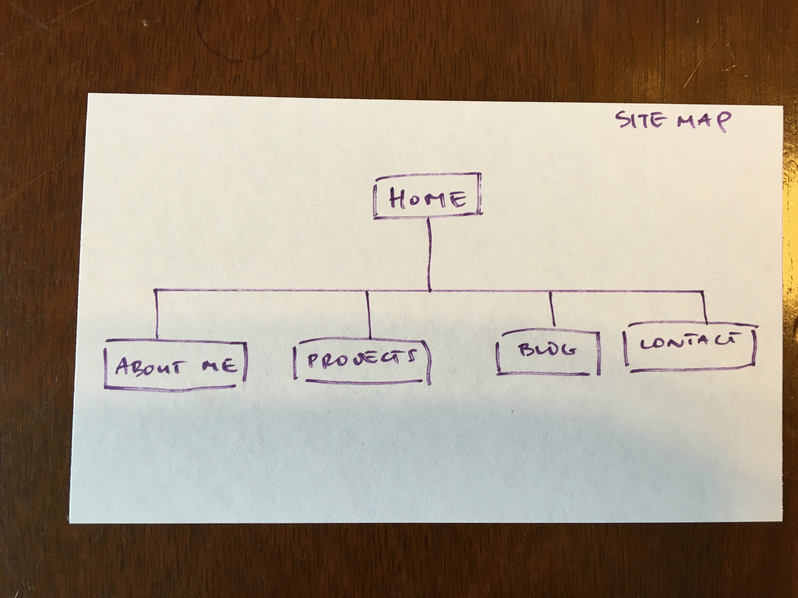

##What are the 6 Phases of Web Design?

1. Information Gathering - Collect information about the site's primary purpose and goal, the target audience, and the content needed.

2. Planning - Develop a site map and decide what technologies should be implemented.

3. Design - Determine the look and feel of the website.

4. Development - Create actual website that is functional and includes graphical elements.

5. Testing & Delivery - test for funcitionality and compatibility issues. After final approval, a file transfer protocol program is used to upload website files to server.

6. Maintenance - Update website with new content and features as needed.

##What is your site's primary goal or purpose? What kind of content will your site feature?
The primary purpose of my site is to share information that will highlight my professional experience. It will include a section about me (work history, background, passions), contact information (including social media), a link to my blog, and projects.

##What is your target audience's interests and how do you see your site addressing them?
My target audience is potential employers. Potential employers will be able to read my blog and view my portfolio of projects to learn more about me. If they are interested (let's hope they are!), they will be able to easily find my contact information to reach out to me.

##What is the primary "action" the user should take when coming to your site? Do you want them to search for information, contact you, or see your portfolio? It's ok to have several actions at once, or different actions for different kinds of visitors.
The primary action of the user is to read my about me page, see my portfolio, and then contact me.

##What are the main things someone should know about design and user experience?
User Experience Design does not work the same way in every scenario because humans are subjective. It is also important to note that it is not possible to measure the success of user experience design with statistics or other standard metrics. Usability, the ease of use and the efficiency of an interface, is a part of User experience, but not all of it. 

##What is user experience design and why is it valuable?
User experience design is a discipline that focuses on how users feel when they interact with a system. It is valuable because websites are only effective if users are able to get the information they are seeking. Since users are now looking at websites on multiple browsers, devices, internet connections, it is important that they all have a positive experience on the same website.

##Which parts of the challenge did you find tedious?
I am currently having trouble displaying my site map image. I suspect the issue is because I keep using the wrong relative path. I decided walk away from the problem to complete these reflection questions. I plan on returning to this problem tomorrow to work on fixing the image.