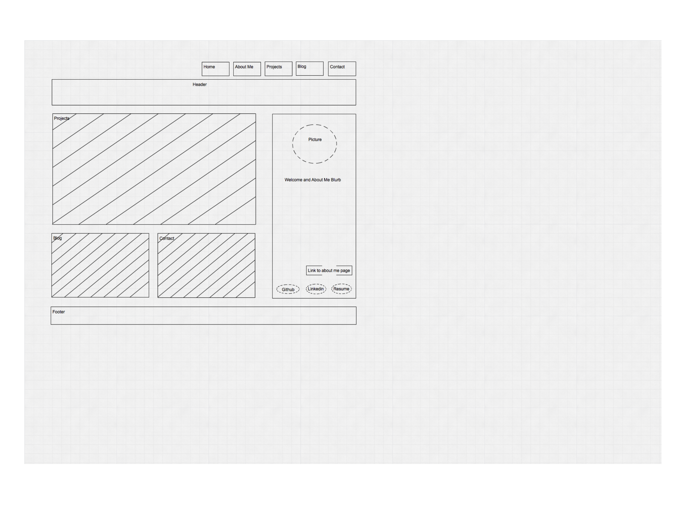
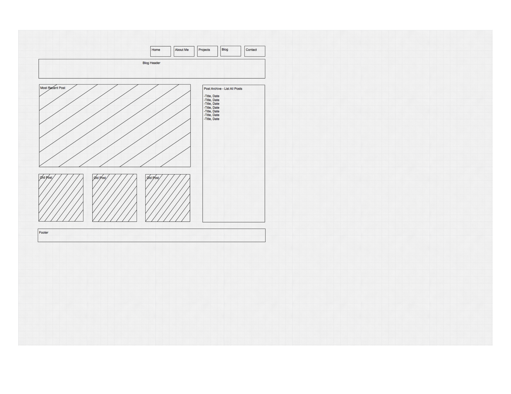

##What is a wireframe?
It is a visual tool that helps you organize the structural layout of your website. Wireframes are used to show the hierarchy of the content on a web page and how a user would navigate through pages. It does not include colors, font types, and other design elements. 

##What are the benefits of wireframing?
Wireframes can help you decide how you want the user to navigate through your website. Creating wireframes can save time and money because the structural layout of a website can be decided on and revised before coding begins.

##Did you enjoy wireframing your site?
I like looking at website designs and layouts, so I really enjoyed creating wireframes. The process of creating a wireframe before starting to write code fits nicely with the way I work.

##Did you revise your wireframe or stick with your first idea?
For this challenge, I revised my wireframes a couple of times during the development process to create my first set of templates. I will probably make changes to my wireframes again once I learn more about what is possible in html and css.

##What questions did you ask during this challenge? What resources did you find to help you answer them?
How are site maps and wireframes different? I read different blogs and articles that helped clarify the differences between the two. Even though they both relate to a website's layout, site maps provide a visual directory of where all the content is housed and wireframes are visual blueprint of the website's structure.

##Which parts of the challenge did you enjoy and which parts did you find tedious?
I did not find any part of the challenge tedious. I liked looking up examples of wireframes. Whenever I visit a website now, I can't help but notice the structure of its design!