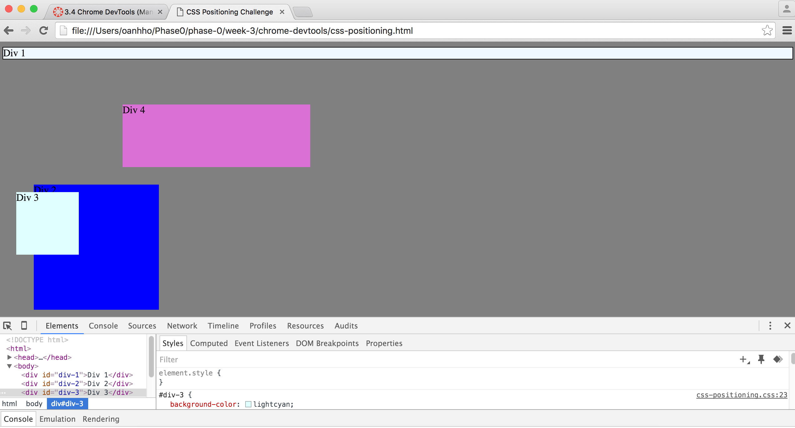
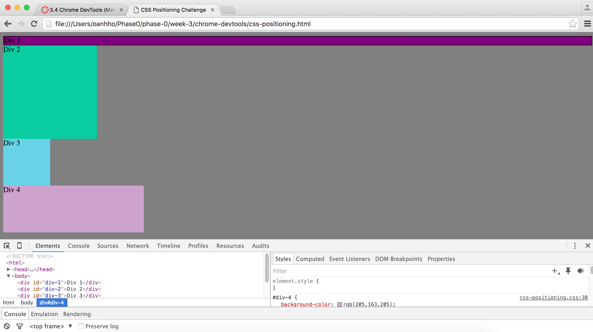
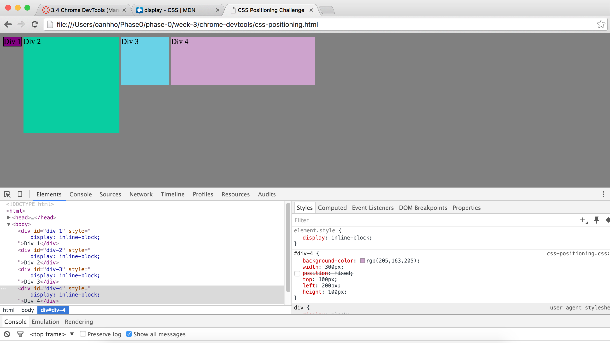
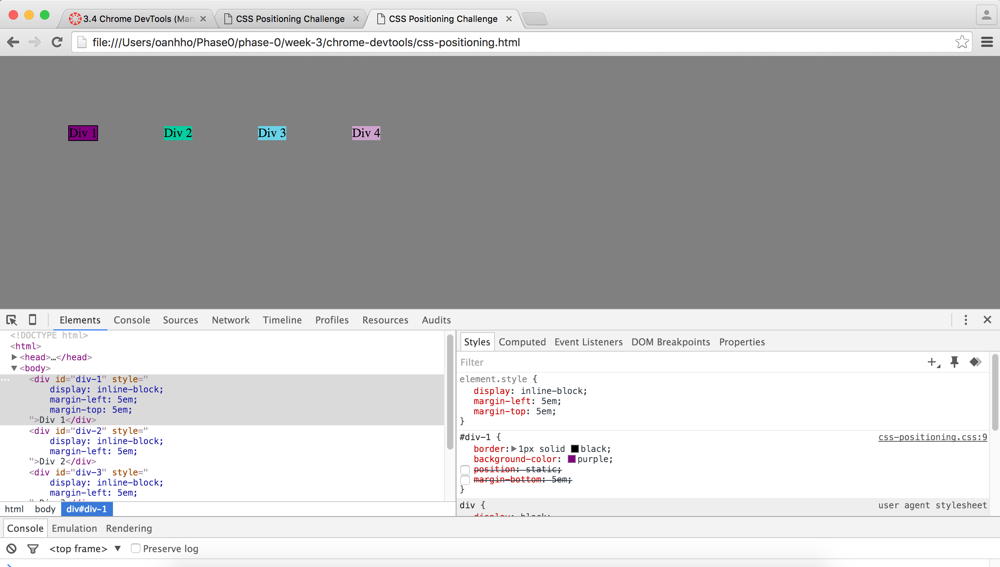
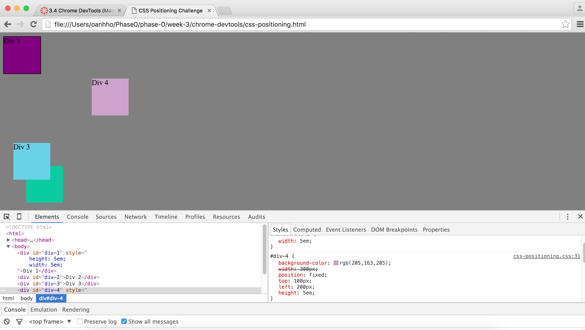
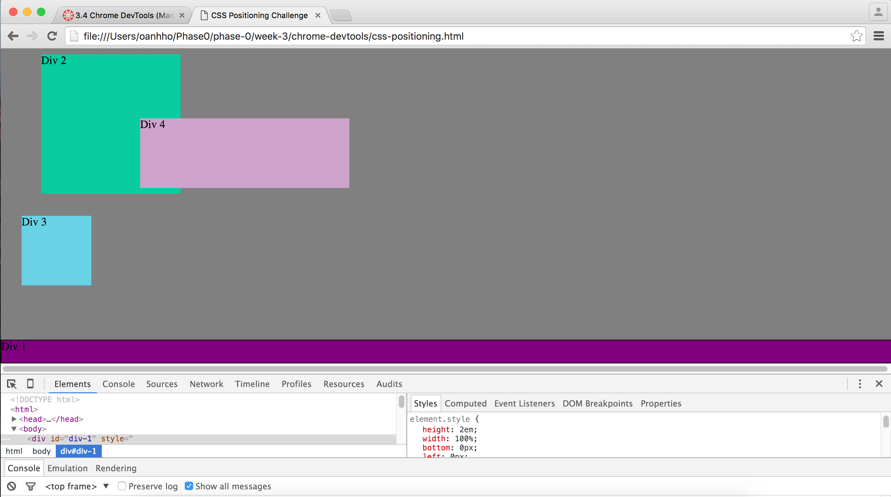
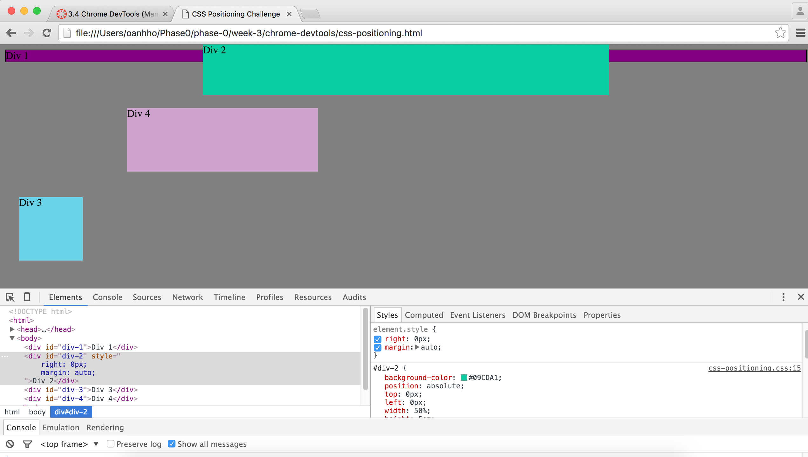
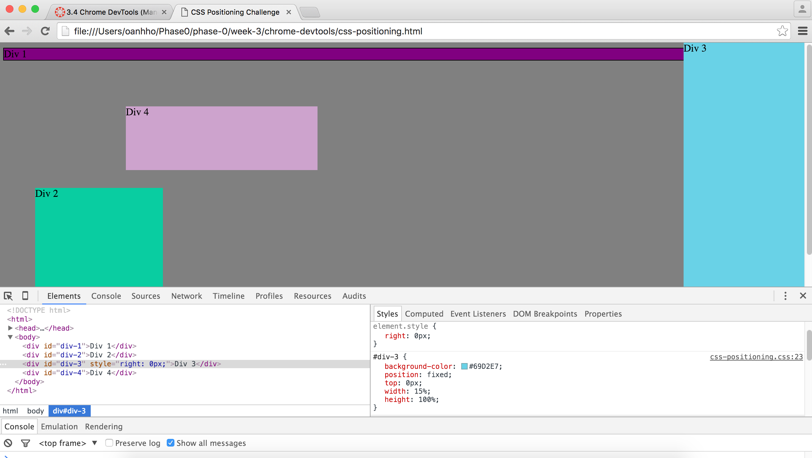
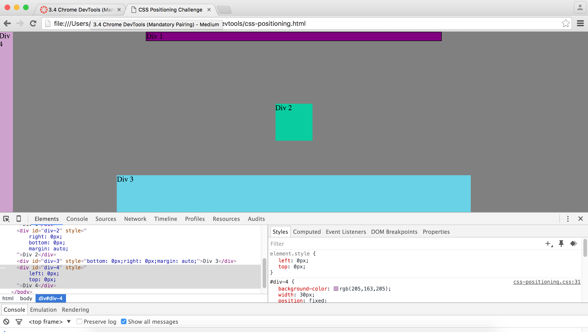

##How can you use Chrome's DevTools inspector to help you format or position elements?
Chrome DevTools allows you to view every element and all the styles added to in on a website. By modifying the style properties and values of each element, you can adjust its format and position.

##How can you resize elements on the DOM using CSS?
You can resize elements on the DOM by changing the height and width properties. The value can be in pixels, ems, or percentages.

##What are the differences between absolute, fixed, static, and relative positioning? Which did you find easiest to use?

1. Absolute: Absolute positioned elements are not affected by and do not affect the position of any other elements. They are taken out of the normal flow order and can be positioned anywhere on a site. When a user scrolls up and down on the page, these elements move with the page.

2. Fixed: Elements with fixed position do not affect the position of other elements. When the user scrolls, the elements with fixed position stay in place on the screen and do not move.

3. Static: Static positioning is the default for every element on the page. The elements flow in the normal order.

4. Relative: Relative positioned elements do not affect the position of any other elements. They move relative to their normal position and do not move unless additional positioning attributes are applied such as top, bottom, left and right. Relative positioned elements only move from where they would normally be.

##Which was most difficult?
The header took us the most time. After giving the Div 2 box a width, we tried setting margin-left and margin-right to auto to center the box, however, that did not work. After trial and error, we set the top, right, and left positions to 0px and the margin to auto. That worked but I am interested in playing around with this challenge to see if there are alternative solutions.

##What are the differences between margin, border, and padding?
Borders exists around every box. Margin exists outside the border. Margins can be adjusted to create or reduce space between borders. Padding is the space between a border and the content inside a box.

##What was your impression of this challenge overall? (love, hate, and why?)
I enjoyed this challenge because I like learning through trial and error. Making different changes to the same html/css files was a great way for us to practice and start over whenever we got stuck. It was very neat introduction to Chrome DevTools!

**Chrome DevTool Images**
1. Change Color 

2. Column 

3. Row 

4. Make Equidistant

5. Squares 

6. Footer 

7. Header 

8. Sidebar 

9. Get Creative 

