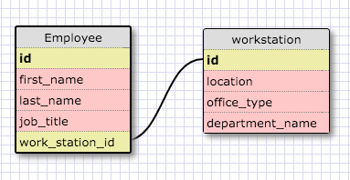
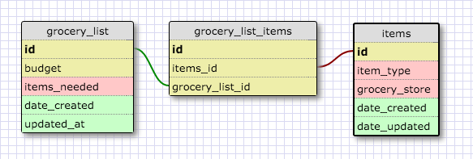

##One to One Schema

The example above demonstrates a one to one relationship between two 
databases. Every employee is assigned one work station and each workstation 
belongs to only one employee. Even though it would be possible to eliminate 
the workstation table by creating a new field called "work station number" 
in the employee table, the rule of thumb is to use a one-to-one relationship 
between different databases if the field can be empty. Since it is be 
possible to have an empty( NULL) work station number if an employee to works 
from home, the workstation information should be put on a second table and 
linked to the employee table using a one-to-one relationship.

##Many to Many Schema

Grocery lists have many items. Items are stocked at at many grocery stores. 
A join table connects the grocery list and items table to model the many to 
many relationship between both databases.

##Reflection

###What is a one-to-one database?
A one to one database refers to a singular relationship between two 
different databases. For example, a person can have one standard driver's 
license and that license number belongs to one person. 

###When would you use a one-to-one database? (Think generally, not in terms
###of the example you created).
If a primary database has an optional field that can be left empty, it would 
be best to put that information in a separate table. Large amounts of 
descriptive data and sensitive information would be best kept in a secure 
secondary table as well.

###What is a many-to-many database?
This refers to databases that have multiple relationships with eachother. 
Authors can write many books. Books can be written by many authors.

###When would you use a many-to-many database? (Think generally, not in 
terms of the example you created).
You would use a many to many table if one or more of the fields in a table 
is associated with one or more fields in a second table.

###What is confusing about database schemas? What makes sense?
I am having a bit of trouble understanding how to implement many to many 
relationships. Implement one-to-one and one-to many relationships is easier.